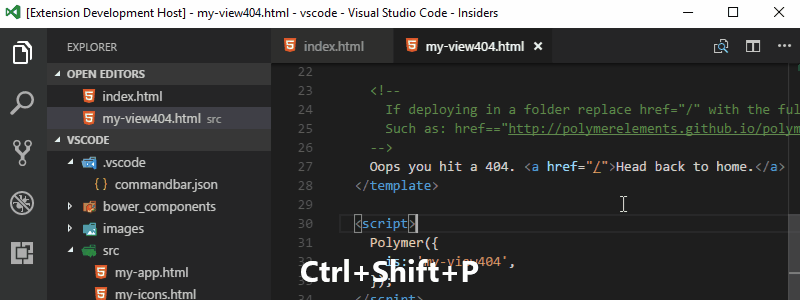
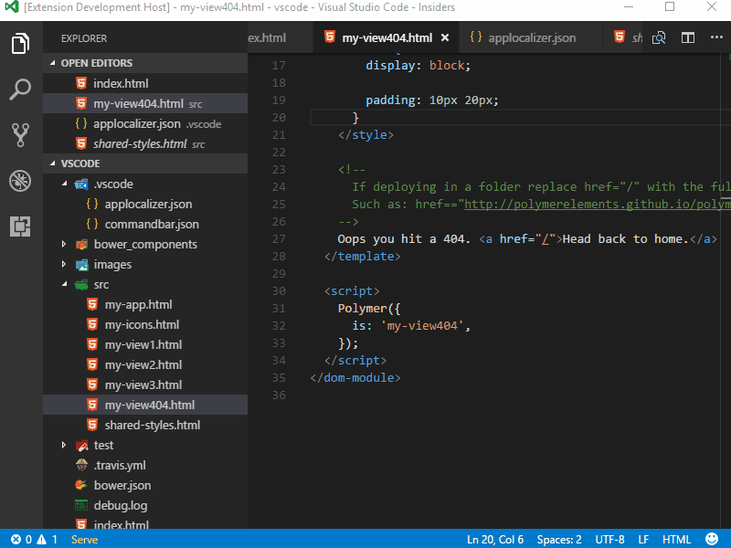

# Visual Studio Code Application Localizer

Visual Studio Code Application Localizer.

> Utilizes [app-localizer](https://github.com/ppatotski/app-localizer)
>
> [](https://www.npmjs.com/package/app-localizer)

## Features

* Locale validator
	- Check for missing labels
	- Multi-file locale support (see [example](#multi-file-locale-example) below)
		* Polymer file structure
		* Angular flat file structure
* Pseudo localizer
    - Accents on letters
    - Longer sentence
    - Longer word
    - Right-to-Left
    - Enclose in exclamations
    - Enclose in brackets
	- Support [ICU Message syntax](https://formatjs.io/guides/message-syntax/)
* Create default settings file (`Ctrl+Shift+P` or `Cmd+Shift+P` type `Applocalizer: Settings`)
	- Apply settings immediately after saving changes in `./.vscode/applocalizer.json` file

## Get Started

[](getstarted.gif)

## Demo

[](demo.gif)

## Configuration

### Config file example (`./.vscode/applocalizer.json`)
```json
{
	"validator": {
		"multiFile": false,
		"filePathPattern": "**/locales.json",
		"fileStructure": "polymer"
	},
	"pseudoLocale": {
		"expander": 0.3,
		"exclamations": true,
		"brackets": true,
		"accents": true,
		"rightToLeft": false,
		"wordexpander": 0.5
	}
}
```

### Configuration file schema (documentation)
```json
{
	"validator": {
		"type": "object",
		"description": "Validate locales (checking for missing labels)",
		"properties": {
			"multiFile": {
				"type": "boolean",
				"description": "Each locale is in separate file in the same folder.",
				"default": "false"
			},
			"filePathPattern": {
				"type": "string",
				"description": "Pattern of locale files path",
				"default": "**/locales.json"
			},
			"fileStructure": {
				"type": "string",
				"description": "Structure of locale file content",
				"default": "polymer",
				"enum": [
					"polymer",
					"angular.flat"
				]
			}
		}
	},
	"pseudoLocale": {
		"type": "object",
		"description": "Pseudo localizer settings",
		"properties": {
			"expander": {
				"type": "number",
				"description": "Expand factor 0.3 = 30%",
				"default": 0.3
			},
			"wordexpander": {
				"type": "number",
				"description": "Expand factor 0.5 = 50%",
				"default": 1
			},
			"brackets": {
				"type": "boolean",
				"description": "Enclose in brackets"
			},
			"exclamations": {
				"type": "boolean",
				"description": "Enclose in exclamations"
			},
			"accents": {
				"type": "boolean",
				"description": "Convert letter to its accent version"
			},
			"rightToLeft": {
				"type": "boolean",
				"description": "Left-to-Right"
			}
		}
	}
}
```
## Single-File locale example

### file with locales `/locales/locale.json`
```json
{
	"en-us": {
		"label3": "blah3 {token}",
		"label1": "blah1",
		"label2": "blah2",
		"label4": "blah4"
	},
	"de-de": {
		"label3": "blah3 {token}",
		"label1": "blah1",
		"label2": "blah2",
		"label4": "blah4"
	}
}
```

## Multi-File locale example

### file with en-us locale `/locales/en-us.locale.json` (polymer file structure)
```json
{
	"en-us": {
		"label3": "blah3 {token}",
		"label1": "blah1",
		"label2": "blah2",
		"label4": "blah4"
	}
}
```

### file with fr locale `/locales/fr.locale.json` (angular flat file structure)
```json
{
	"label1": "blah1 {{token}}",
	"label2": "blah2",
	"label5": "blah3",
	"label3": "blah4"
}
```

## Change Log

[Change Log](CHANGELOG.md)

## License

[MIT](LICENSE.md)
