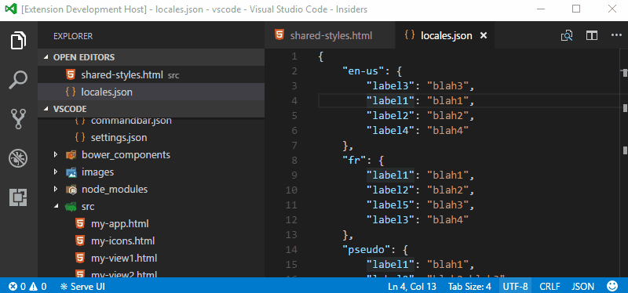
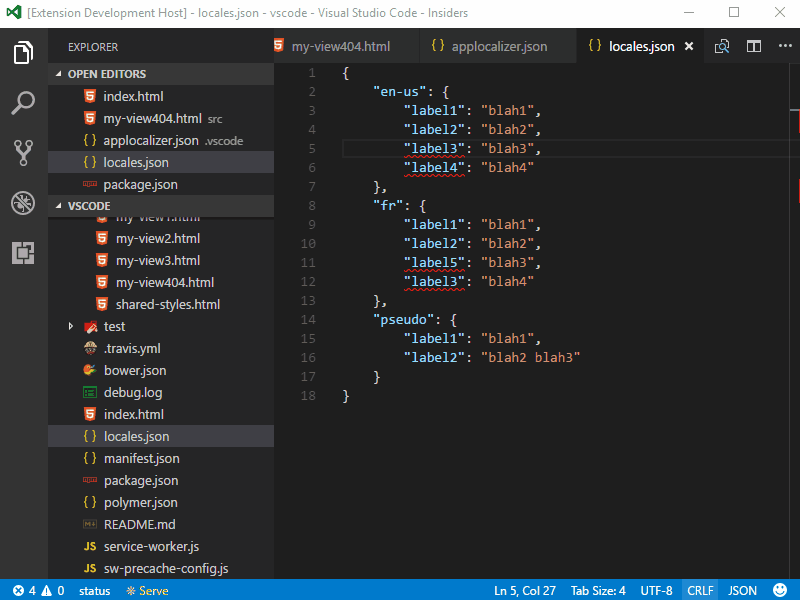

# Visual Studio Code Command bar

Visual Studio Code Application Localizer.

## Get Started

[](getstarted.gif)

## Features

* Pseudo localizer (char mapping is taken from [there](https://code.google.com/archive/p/pseudolocalization-tool/))
    - Accents on letters
    - Longer sentence
    - Right-to-Left
    - Brackets wrapping
* Create default settings
* Coming soon: Locale validator

[](demo.gif)

## Configuration

### Config file example (`./.vscode/applocalizer.json`)
```json
{
    "validator": {
        "autoFix": false,
        "localizationFiles": "./locales/*.json"
    },
    "pseudoLocale": {
        "expander": 0.3,
        "brackets": true,
        "accents": true,
        "rightToLeft": false
    }
}
```

### Configuration file schema (documentation)
```json
{
    "validator": {
        "type": "object",
        "description": "Coming soon"
    },
    "pseudoLocale": {
        "type": "object",
        "description": "Pseudo localizer settings",
        "properties": {
        "expander": {
            "type": "number",
            "description": "Expand factor 0.3 = 30%",
            "default": 0.3
        },
        "brackets": {
            "type": "boolean",
            "description": "Wrapping text in brackets"
        },
        "accents": {
            "type": "boolean",
            "description": "Convert letter to its accent version"
        },
        "rightToLeft": {
            "type": "boolean",
            "description": "Left-to-Right"
        }
    }
}
```

## License

[MIT](LICENSE.md)
